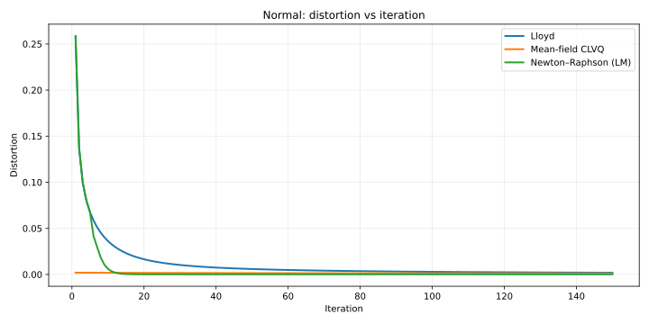
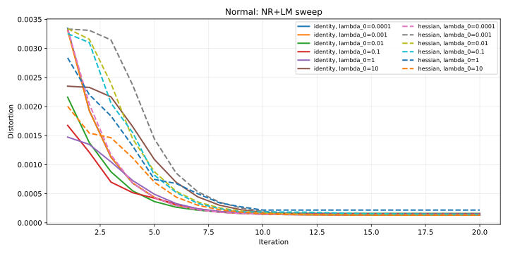
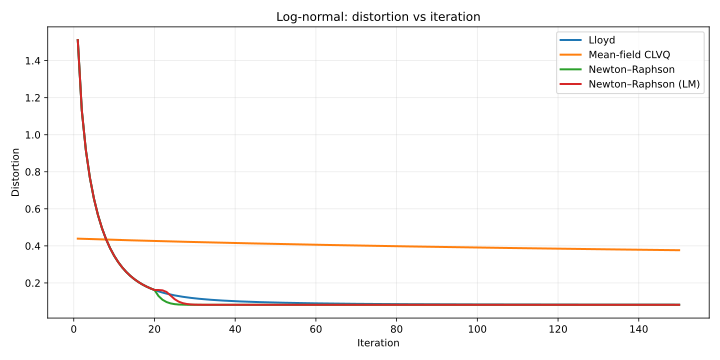
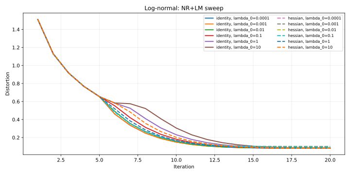
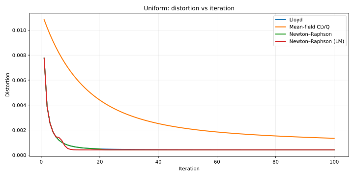
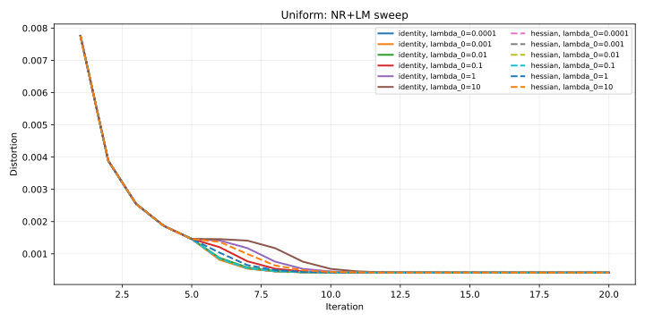
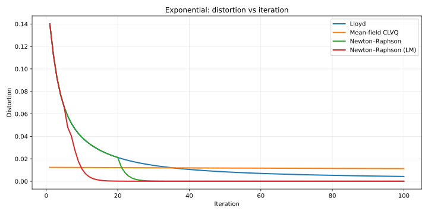
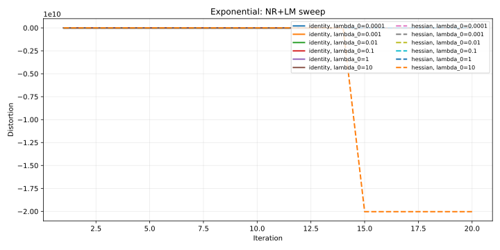

# Notebook plots (static SVGs for GitHub)

GitHub does not render interactive Bokeh outputs inside notebooks reliably. During notebook execution we therefore **save SVG snapshots** to `notebooks/_svg/` and then display them in-notebook. This page embeds the same SVGs so they render directly on GitHub.

Each distribution has two plots:

- **Optimizer comparison**: distortion vs iteration for the selected methods (all start from the same initial centroids).
- **NR+LM sweep**: distortion vs iteration while sweeping \( \lambda_0 \in [10^{-4}, 10^{-3}, 10^{-2}, 10^{-1}, 1, 10] \) and `diagonal_term_type ∈ {identity, hessian}` for the **NR+LM** method.

To regenerate all SVGs locally, run:

```bash
DETERMINISTIC_QUANTIZATION_LOG_LEVEL=ERROR scripts/run_notebooks.sh
```

## Normal distribution

- **What you’re seeing**: the same initial centroids are optimized by the chosen methods; faster methods drop distortion sooner.

### Optimizer comparison



### NR+LM sweep (\(\lambda_0\) × diagonal term)



## Log-normal distribution

- **What you’re seeing**: heavier right tail; depending on initialization, Newton-type methods can be sensitive, while LM damping can stabilize steps.

### Optimizer comparison



### NR+LM sweep (\(\lambda_0\) × diagonal term)



## Uniform distribution

- **What you’re seeing**: the optimum is relatively “regular”; many methods converge smoothly and comparisons are often easier to interpret.

### Optimizer comparison



### NR+LM sweep (\(\lambda_0\) × diagonal term)



## Exponential distribution

- **What you’re seeing**: mass near 0 with a long tail; step size control (LM damping) can matter more to avoid unstable Newton steps.

### Optimizer comparison



### NR+LM sweep (\(\lambda_0\) × diagonal term)



